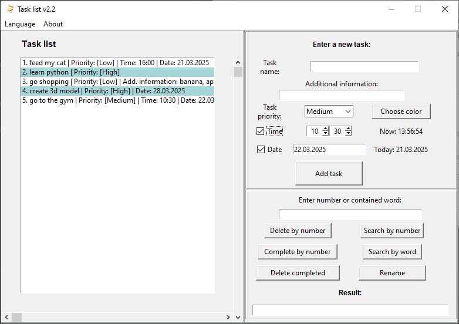

<h1 align="center">
  
</h1>

# Task list (Python 3.12, Tkinter)

## Инструкция по работе с проектом

### Запуск
> Перед запуском необходимо убедиться, что все файлы проекта находятся в одной 
> папке, рядом с файлом `task_list.exe`:
> - `about_eng.txt`
> - `about_rus.txt`
> - `config.ini`
> - `favicon.ico`
> - `languages.csv`
> - 
### Добавление задач
> Для добавления задачи обязательным полем является `Название задачи`. 
> Также, не забудьте указать `Приоритет задачи`, т.к. этот параметр укажется автоматически на основе выбранного пункта.
> Поля `Дополнительная информация`,`Время` и `Дата` не обязательны. 
> Кнопка `Выбрать цвет` позволяет выбрать цвет одновременно для всех задач с высоким приоритетом.

### Настройка календаря при редактировании проекта
> На версии python 3.12 календарь не работает корректно. Чтобы это исправить, в файле по пути:
> 
> `\.venv\Lib\site-packages\tkcalendar\calendar_.py` нужно прописать импорт:
> - `import calendar`
> - `from babel.dates import format_date, parse_date, get_day_names, get_month_names`
> - `from babel.numbers import * `